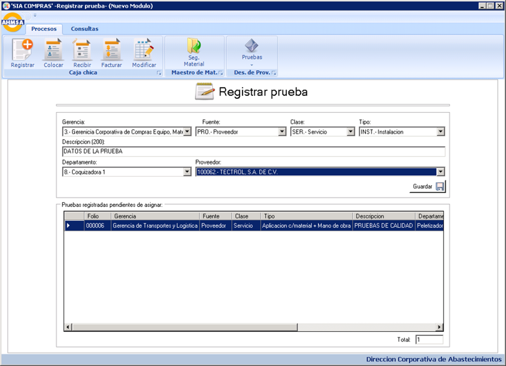
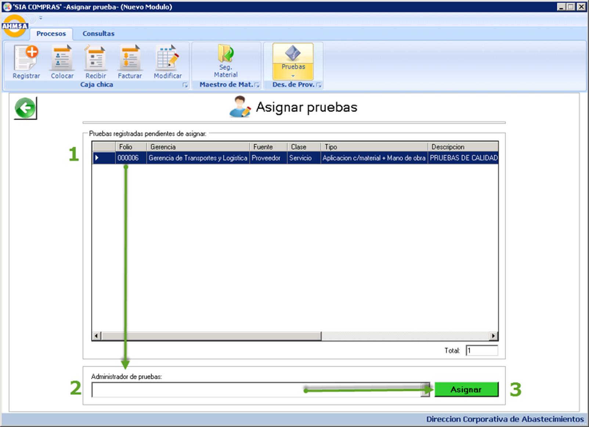
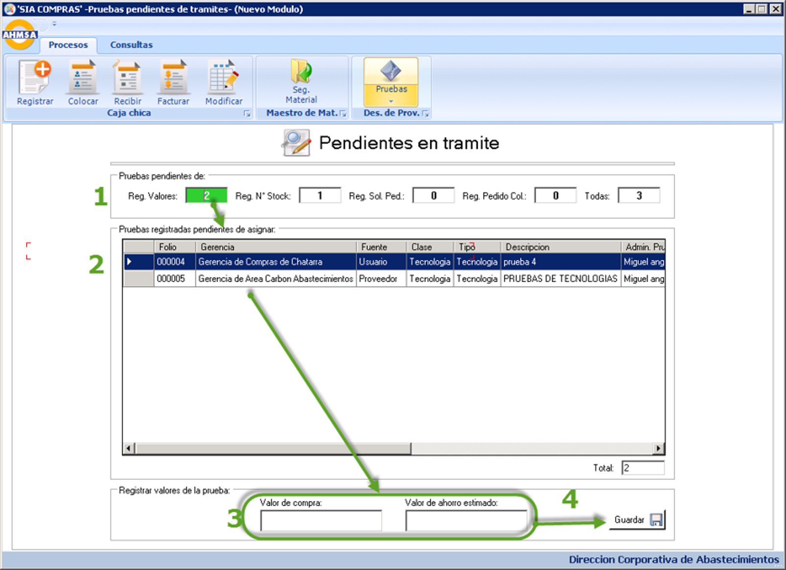
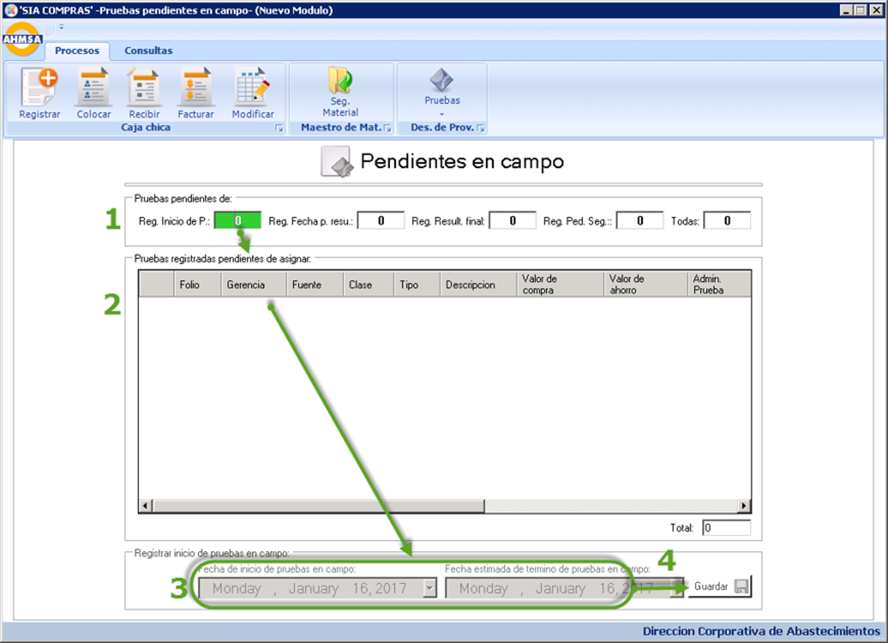

# 🔬 SIA – Material Testing Module

## 🧭 Overview
The **Material Testing Module** is a key component of the **SIA (Sistema Integral de Abastecimientos)** system, developed in **C#** and **SQL Server** using **Visual Studio**. It was designed to standardize and digitize the process of receiving, testing, and approving materials provided by vendors for construction and maintenance projects.

It replaced error-prone spreadsheet tracking and email-based workflows used by the **Warehouse and Quality Control departments** at AHMSA.

### Register Material Test
> 

### Assign Material
> 

### Tests in progress
> 

### Test in the field
> 

## 💡 Idea & Concept
Created in response to a departmental restructuring, the goal was to give fewer staff better tools to manage:
- Test reception and assignment
- Review of material certifications and sources
- Multi-stage testing with full traceability
- Analytics of successful vs failed materials and savings

## ✨ Features & Functionality
- 📦 Register Material Test:
  - Department, material, type of test, vendor, cost, service type, etc.
- 📋 Assign Test:
  - Manager validates whether it proceeds, then assistants assign to test staff
- 🔍 Test Status:
  - Filter by: registered, in progress, completed, approved/rejected
- 🔁 Test Execution:
  - Register material value, savings estimate, stock number, cost code, contract
  - Save result summary and test observations
- 📆 Testing in Field View:
  - Pending start date, pending result entry, final test evaluation
- 🔐 Role-based access per department
- 🛠 Admin tools for module lock, version enforcement, and audit logging
- 🔔 Auto-start and always-on configuration for operational continuity
- 🔒 Multi-instance prevention and form embedding design

## ⚙️ Tech Stack
- **Language:** C#
- **Framework:** .NET WinForms
- **Database:** SQL Server
- **IDE:** Visual Studio
- **Reporting:** Crystal Reports

## 🏗 Architecture & Design
- Ribbon-style interface grouped under “Warehouse” operations
- Embedded form structure within a master container window
- SQL-based backend shared across all SIA modules
- Uses stored procedures for complex validations and data integrity

## 🚀 Installation & Setup
- **Deployment:** Internal Windows environment with shared folder deployment
- **Startup:** Auto-launch on system boot
- **Security:** Login control, screen size restriction, update lockouts

> **Note:** Only validated users can submit or modify test records.

## 🧑‍💻 My Role & Contributions
- 💼 Designed and developed the full Material Testing module
- 🧱 Built the SQL schema, stored procedures, and validations
- 🧪 QA testing and multi-role simulation with different profiles
- 🔧 Embedded screens within the main application container

## 🧗 Challenges & Learnings
- Replacing an outdated manual system with reliable structured workflows
- Managing screen logic for multi-stage test input
- Implementing data lock controls and usage tracking
- Enabling usage analytics to determine unused screens or logic

## 📈 Future Enhancements
- BI integration to analyze test results across departments
- Notifications for pending actions (approvals, test completions)
- Exportable dashboards for vendor performance

## 🪪 License
⚠️ **Internal Use Only**  
Originally under MIT; changed to **CC BY-NC-ND 4.0** as of April 22, 2025.

## 🔗 Related Projects
- **[SIA](https://github.com/HermiloOrtega/SIA)**
- **[SIA – Petty Cash Module](https://github.com/HermiloOrtega/SIA-Petty-Cash)**
- **[SIA – Material Testing Module](https://github.com/HermiloOrtega/SIA-Material-Testing)**